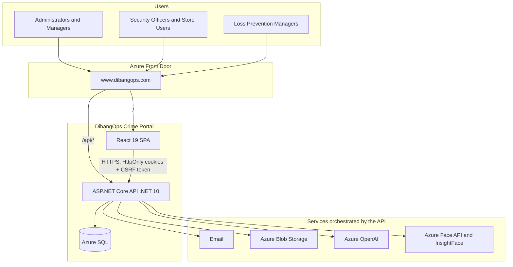
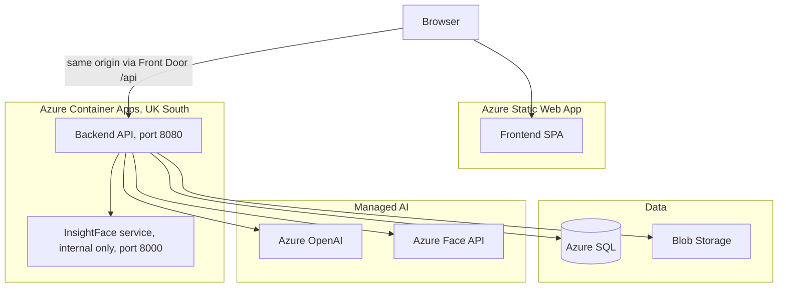
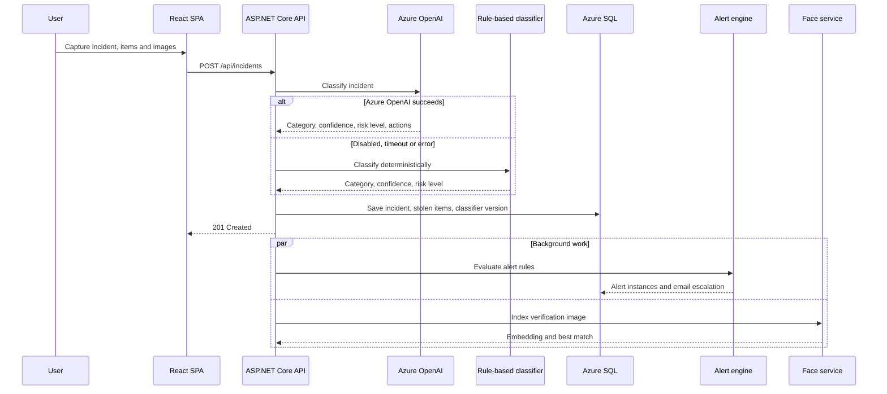
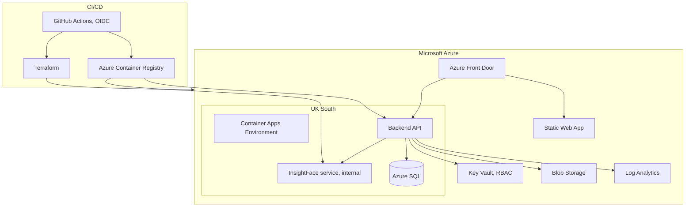
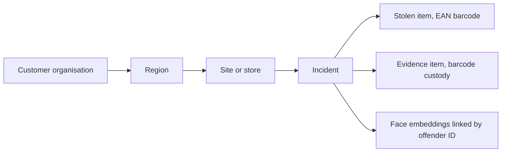

# DibangOps Crime Portal™: Architecture

This document describes the production architecture of the platform and the main design decisions behind it. GitHub renders the diagrams directly from the Mermaid source below.

## 1. System context

Store users, security officers, Loss Prevention Managers and administrators reach the platform through Azure Front Door. Front Door serves the SPA and the API (`/api/*`) from a single origin, which keeps cookie-based authentication simple and avoids CORS.

## 2. Containers

| Container | Technology | Responsibility |
|-----------|-----------|----------------|
| Web client | React 19, Vite, TypeScript | UI, routing, role-based navigation, barcode and camera capture |
| API | ASP.NET Core, .NET 10 | Authentication, tenant scoping, business logic, AI orchestration, alerts |
| Face service | Python, InsightFace (internal ingress only) | Face detection and embedding for offender matching |
| Database | Azure SQL, EF Core | Relational data, identity, 150+ migrations |
| Object storage | Azure Blob Storage | Incident images and evidence files (not publicly accessible) |

## 3. Incident creation and AI processing

Classification runs inline so that the category and risk level are available as soon as the incident is saved. Alert evaluation and face indexing run in the background after the response is returned, so reporting stays fast for store staff.

## 4. Deployment and infrastructure

All Azure resources are defined in Terraform (`/Infrastructure`). GitHub Actions authenticates to Azure with OIDC (no stored cloud credentials), builds container images into Azure Container Registry, runs the backend tests, deploys, and smoke-tests `/api/health` and TLS through Front Door. Production uses a blue/green layout (`prod-v2`) so that infrastructure changes can be cut over and rolled back safely.

## 5. Tenancy model

Organisations share one database. Every request carries the user's role and organisation in its claims, and the API applies tenant filters to queries, so one organisation can never see another's data.

| Role | Scope |
|------|-------|
| Administrator | All organisations |
| Manager | Own organisation |
| Security officer | Assigned sites |
| Store | Own site and own records |

## 6. Key design decisions

| Decision | Why | Trade-off accepted |
|----------|-----|--------------------|
| Shared database with claim-based tenant filters | One platform can serve several retail organisations at low cost | Isolation relies on application-layer discipline, so every query goes through tenant-scoped helpers |
| Azure OpenAI with a deterministic rule-based fallback | An LLM outage must never leave an incident unclassified | The fallback is less nuanced; the classifier version is stored per incident so fallback usage is visible |
| Classification inline, alerts and face indexing in the background | Store staff need a fast submit; managers need a risk level immediately | Background work is eventually consistent, so an alert can arrive seconds after the incident |
| HttpOnly cookies, CSRF validation and 2FA for management roles instead of bearer tokens in the browser | The system holds offender personal data and images, so XSS token theft must be designed out | CSRF handling adds complexity on every state-changing request |
| One origin for the SPA and API through Front Door | Simpler cookies, no CORS, one TLS certificate | Routing rules and Front Door state have to be managed in Terraform |
| InsightFace on internal-only ingress, alongside Azure Face API | Biometric processing is not exposed to the internet, and there is no lock-in to one provider | An extra container to build, run and patch |
| Database-driven page permissions | Access can change per client without a redeploy | Permissions data must be seeded and migrated carefully |
| Terraform with blue/green production | Repeatable environments and a safe cutover for infrastructure changes | Terraform state management overhead |
| Azure SQL tier set per environment in Terraform | Keeps hosting cost in line with current scale | Tier changes need a planned migration |

## 7. Data protection

The platform stores offender personal data and biometric data, so data protection shaped the design:

- Row-level tenant scoping and least-privilege roles (store users see only their own site)
- Incident and verification images in private Blob Storage
- Face processing on internal-only infrastructure
- Secrets held in Key Vault; none in source control
- Login protection, session timeouts and mandatory 2FA for management roles
