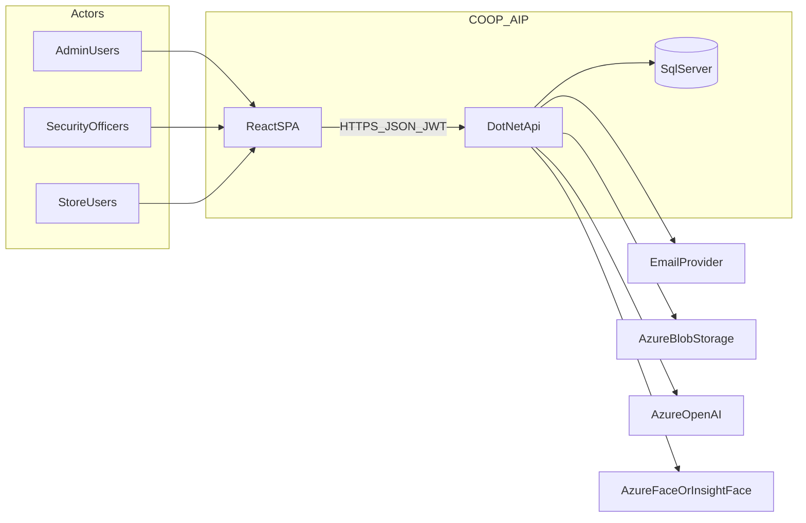
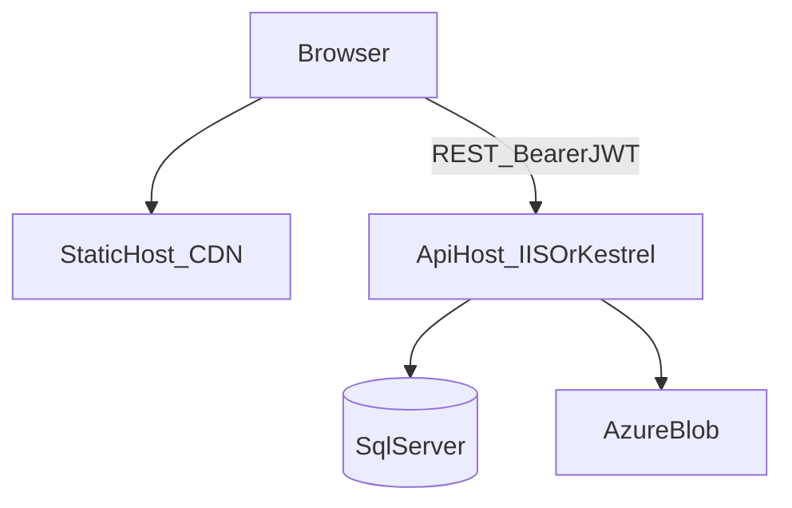
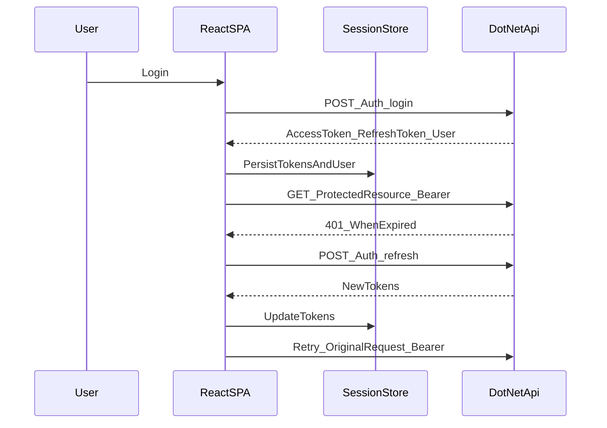

# Technical architecture — COOP_AIP (Security / crime intelligence platform)

**Purpose:** Evidence-oriented technical architecture description for professional portfolios (for example, global talent endorsement). **Scope:** This document is anchored in the repository layout and key implementation files as of the date it was authored; verify live deployment URLs and credentials separately.

---

## 1. Executive summary

COOP_AIP is an **enterprise-style security and crime-intelligence web platform** that supports **multi-customer hierarchies** (customers, regions, sites), **role-based access** for administrators, managers, security officers, and store users, and **operational workflows** including incidents, evidence, alerts, analytics, and integrations with **Azure AI and face-recognition** services where configured. The system is implemented as a **React + TypeScript single-page application** ([`AIP_UI`](../AIP_UI)) talking to an **ASP.NET Core REST API** ([`AIP_Backend`](../AIP_Backend)) backed by **Microsoft SQL Server** via **Entity Framework Core**, with **optional Azure Blob Storage** for incident imagery and **JWT-based authentication** including refresh-token handling on the client. The stack prioritizes **clear API contracts**, **typed configuration**, and **separation of UI, API, and persistence** so the product can evolve under regulated, operationally sensitive workloads.

---

## 2. System context (C4 Level 1)

**Primary actors**

- **Internal operators:** administrators and managers configuring customers, users, page access, and reference data.
- **Field / store users:** security officers and store roles recording incidents, evidence, and operational tasks.
- **Customer-tier users:** where the domain model assigns users to a customer context (see `ApplicationUser` / customer relationships in EF).

**System boundary**

- **COOP_AIP** = browser SPA + backend API + relational database + optional file/blob storage + optional cloud AI/face APIs.

**External systems**

- **Email** (contact and operational notifications via backend email services).
- **Azure Blob Storage** (when configured for incident image storage).
- **Azure OpenAI** (incident classification and related AI features when enabled).
- **Azure Face / InsightFace** (offender recognition pipeline; **InsightFace is selected at runtime** when `InsightFace:Enabled` is true, otherwise the Azure Face–based implementation is used — see [`AIP_Backend/Program.cs`](../AIP_Backend/Program.cs)).

---

## 3. Container view (C4 Level 2)

| Container | Technology | Responsibility | Key repo location |
|-----------|------------|----------------|-------------------|
| **Web client** | React 18, Vite, TypeScript, Tailwind, Radix UI | UX, routing, client-side auth/session, API calls | [`AIP_UI`](../AIP_UI) |
| **API** | ASP.NET Core, controllers + services | AuthN/Z, business rules, persistence, integrations | [`AIP_Backend`](../AIP_Backend) |
| **Database** | SQL Server + EF Core | Authoritative relational data, Identity | [`AIP_Backend/Data/ApplicationDbContext.cs`](../AIP_Backend/Data/ApplicationDbContext.cs) |
| **Object storage** | Azure Blob (optional) | Binary incident imagery when blob mode is enabled | Config + [`IncidentImageStorageService`](../AIP_Backend/Services/IncidentImageStorageService.cs) |

**API base URL (frontend):** Validated with Zod in [`AIP_UI/src/config/env.ts`](../AIP_UI/src/config/env.ts); default `VITE_API_BASE_URL` is `http://localhost:5128/api` for local development.

---

## 4. Frontend architecture

### 4.1 Composition root and cross-cutting providers

[`AIP_UI/src/App.tsx`](../AIP_UI/src/App.tsx) composes:

- **Redux** (`Provider`) for selected global client state.
- **TanStack Query** (`QueryClientProvider`) with production-oriented retry and stale-time defaults.
- **Theme** (`ThemeProvider`) with system preference and persisted key (`aip-theme`).
- **Auth** (`AuthProvider`) and **customer selection** (`CustomerSelectionProvider`).
- **Global error boundary** (`AppErrorBoundary`).
- **Toasts** (Shadcn toaster + React-Toastify).

### 4.2 Routing and layout

[`AIP_UI/src/routes.tsx`](../AIP_UI/src/routes.tsx) uses **React Router** `createBrowserRouter` with:

- Top-level wrappers: **page access** (`PageAccessProvider`), **session timeout**, **navigation tracking**, **customer selection URL sync**, and related utilities.
- **Lazy-loaded** public pages (About, Privacy, Terms, Contact) behind `Suspense`.
- **Protected** application shell under `Layout` with `ProtectedRoute` and **role-based** `allowedRoles` where required (for example, settings and administration routes).

### 4.3 State management strategy

- **Redux Toolkit:** [`AIP_UI/src/store/store.ts`](../AIP_UI/src/store/store.ts) — feature slices such as users, contacts, and quiz-related state. Use Redux where **client-owned** or **cross-screen** UI state benefits from a single store.
- **TanStack Query:** Default client in `App.tsx` for **server-state** patterns (caching, refetch, mutations) in feature code under [`AIP_UI/src/services/`](../AIP_UI/src/services/) and pages.
- **Context:** Authentication (`AuthContext`), page access (`PageAccessContext`), customer selection (`CustomerSelectionContext`) — see [`AIP_UI/src/contexts/`](../AIP_UI/src/contexts/).

### 4.4 API client and contracts

[`AIP_UI/src/config/api.ts`](../AIP_UI/src/config/api.ts) centralizes:

- **Axios instance** with `baseURL` from environment validation.
- **Request interceptor:** attaches `Authorization: Bearer <accessToken>` from [`AIP_UI/src/state/sessionStore.ts`](../AIP_UI/src/state/sessionStore.ts) (with development logging).
- **Response interceptor:** handles **401** with **refresh-token** coordination (mutex-style `isRefreshing` / shared `refreshPromise`), retries the original request on success, and clears session + redirects to `/login` when refresh or auth validation fails.
- **Endpoint constants** grouped by domain (employees, customers, regions, sites, users, stock, mystery shopper, classification, analytics, evidence, alerts, etc.) to keep the UI aligned with backend routes.

DTO casing: the UI explicitly handles backend **PascalCase** `ApiResponseDto` shapes in places such as [`AIP_UI/src/contexts/AuthContext.tsx`](../AIP_UI/src/contexts/AuthContext.tsx) (`Success`, `Data`, etc.), while the API serializes JSON with **camelCase** property names ([`Program.cs`](../AIP_Backend/Program.cs) `PropertyNamingPolicy = JsonNamingPolicy.CamelCase`).

### 4.5 Authentication UX

- **Login and `/Auth/me`:** `AuthContext` coordinates token storage, user hydration, and error handling.
- **Persistence:** Session data is read early on load to avoid flashing an unauthenticated UI; see `AuthProvider` initialization in `AuthContext.tsx`.
- **Route guards:** [`AIP_UI/src/utils/route-protection.tsx`](../AIP_UI/src/utils/route-protection.tsx) enforces authentication and optional **page-level access** checks.

### 4.6 UI, accessibility, and resilience

- **Component library:** Radix primitives under [`AIP_UI/src/components/ui/`](../AIP_UI/src/components/ui/) with Tailwind styling — supports focus management and accessible patterns when used as intended.
- **Global error boundary:** [`AIP_UI/src/components/error-boundary/AppErrorBoundary.tsx`](../AIP_UI/src/components/error-boundary/AppErrorBoundary.tsx).
- **Performance signals:** [`AIP_UI/src/main.tsx`](../AIP_UI/src/main.tsx) optionally initializes **Web Vitals** and logs via [`AIP_UI/src/utils/logger.ts`](../AIP_UI/src/utils/logger.ts) when analytics flags are enabled.

### 4.7 Local development and mocking (**current** vs **target**)

- **Current (as implemented):** [`AIP_UI/src/main.tsx`](../AIP_UI/src/main.tsx) documents **static mock data** under `src/data/` and explicitly notes **no MSW** service worker on the entry path. The UI also includes an optional **`json-server`** script in [`AIP_UI/package.json`](../AIP_UI/package.json) (`npm run mock-api` → `json-server --watch db.json --port 3001`) for a simple local REST stub — useful for UI-only work when pointed at that port via environment configuration.
- **Target / product direction:** Contract-first development is supported by **shared endpoint constants** and **typed responses** against the real .NET API; introducing **MSW** later would be an incremental addition and is **not** claimed as present in the current entrypoint.

---

## 5. Backend architecture

### 5.1 Hosting and process model

[`AIP_Backend/Program.cs`](../AIP_Backend/Program.cs) configures:

- **IIS integration** when environment variables indicate hosting behind IIS; **development** uses standard Kestrel as usual.
- **HTTPS redirection** in non-development environments.
- **Static files** under `/uploads` mapped to `wwwroot/uploads` for local file storage scenarios.

### 5.2 Layering

- **Controllers** ([`AIP_Backend/Controllers/`](../AIP_Backend/Controllers/)): HTTP surface, validation, authorization attributes/policies.
- **Services** ([`AIP_Backend/Services/`](../AIP_Backend/Services/)): business logic (incidents, analytics, customers, page access, email, alerts, AI, offender recognition, etc.).
- **Repositories** (where used): e.g. region, site, incident, holiday, alert rule repositories registered in `Program.cs`.
- **Persistence:** EF Core `ApplicationDbContext` + migrations under [`AIP_Backend/Migrations/`](../AIP_Backend/Migrations/).
- **DTOs:** [`AIP_Backend/Models/DTOs/`](../AIP_Backend/Models/DTOs/) for stable API shapes.

### 5.3 Identity, JWT, and authorization policies

- **ASP.NET Core Identity** with `ApplicationUser` / `ApplicationRole`, password and lockout rules configured in `Program.cs` (for example: required length **8**, complexity requirements, lockout after **5** failed attempts for **5** minutes).
- **JWT Bearer** authentication: issuer/audience/signing key validation; **role claims** mapped via `RoleClaimType = ClaimTypes.Role`.
- **Authorization policies** registered: `AdminOnly`, `ManagerAndAbove`, `AllRoles` mapping to roles `administrator`, `manager`, `security-officer`, `store`.

### 5.4 Startup behaviors

- **EF migrations** are applied on startup (`Database.Migrate()`) so empty databases are brought up to the latest schema (see `Program.cs`).
- **Page access initialization** runs in a **background task** after startup: idempotent seeding / migration of role-related lookup data and default page access via `IDataSeedingService` and `IPageAccessService` (logged with `ILogger<Program>`).

### 5.5 API documentation

- **Swagger / OpenAPI** is enabled in **development and production** in the current pipeline configuration, with **JWT Bearer** security scheme and filters for file-upload operations ([`FileUploadOperationFilter`](../AIP_Backend/Filters/FileUploadOperationFilter.cs)).

### 5.6 Representative domain modules

Grounded in [`ApplicationDbContext`](../AIP_Backend/Data/ApplicationDbContext.cs) (non-exhaustive):

- **Tenant-like structure:** `Customer`, `Region`, `Site`, assignments and page access (`UserCustomerAssignment`, `CustomerPageAccess`, `PageAccess`, `RolePageAccess`, `PageAccessSettings`).
- **Operations:** `Incident`, `StolenItem`, `EvidenceItem`, `EvidenceCustodyEvent`, `AlertRule`, `AlertInstance`, `Product`, `StockItem`, daily activity and occurrence entities.
- **Workforce / identity:** `Employee`, Identity tables via `IdentityDbContext`.
- **Analytics / risk:** `StoreRiskScore`, services for patterns and risk scoring (`IIncidentPatternService`, `IRiskScoringService`).

---

## 6. Security architecture

### 6.1 Transport and CORS

- **HTTPS** enforced for production API host (`UseHttpsRedirection` when not in development).
- **CORS** policy `AllowSpecificOrigin` ([`Program.cs`](../AIP_Backend/Program.cs)):
  - **Development:** localhost / loopback origins, credentials allowed.
  - **Production:** explicit allow-list (default `https://www.dibangops.com` and `https://dibangops.com`) plus **additional origins** from configuration key `FrontendUrl` (comma-separated).

### 6.2 Authentication tokens

- **Access tokens** are sent as **Bearer** JWTs from the SPA (Axios interceptor).
- **Refresh tokens** are used client-side to obtain new access tokens via `/Auth/refresh` (see refresh flow in [`api.ts`](../AIP_UI/src/config/api.ts)); the API validates identity and issues updated tokens.
- **Browser storage tradeoffs:** Persisting tokens in browser storage improves UX but increases **XSS** risk — mitigations include strict CSP practices (deployment-specific), minimizing `dangerouslySetInnerHTML`, dependency hygiene, and keeping **token lifetimes** and **refresh** semantics server-driven.

### 6.3 Authorization dimensions

- **Role-based route protection** in the SPA (`ProtectedRoute`, `allowedRoles`).
- **Fine-grained page access** synchronized from the backend (`PageAccessProvider`, API under page-access modules) and **server-side** enforcement on protected controllers/policies.
- **Per-request user context** via `IUserContextService` (registered in DI) for auditing and scoping operations.

### 6.4 Data protection and configuration

- **Secrets** (JWT key, connection strings, storage keys) belong in **environment / secure configuration** — see examples like [`AIP_Backend/appsettings.Local.example.json`](../AIP_Backend/appsettings.Local.example.json); do not commit real secrets.
- **PII and operational data** live primarily in **SQL Server**; **binary media** may be stored in **blob storage** or local `wwwroot/uploads` depending on configuration.

### 6.5 JWT metadata note

`RequireHttpsMetadata = false` on the JWT bearer options is common when metadata endpoints are not used in the same way as OAuth2 metadata; **transport security** should still be enforced at the edge (`UseHttpsRedirection` in production). Review this setting if third-party metadata validation becomes a requirement.

---

## 7. Data architecture

**Core relationships (narrative)**

- **Customer** is the top-level organizational anchor; **Regions** and **Sites** hang off customers for geographic and store structure.
- **Incidents** capture events; related **stolen items**, **evidence**, and **alert instances** link operational reporting to downstream workflows.
- **Users** are linked to customers and site assignments as modeled on `ApplicationUser` and related assignment tables.

**Schema evolution:** EF Core **migrations** version the schema ([`AIP_Backend/Migrations/`](../AIP_Backend/Migrations/)); startup migration applies pending changes.

---

## 8. Integrations (config-driven)

| Integration | Purpose | Configuration / code |
|-------------|---------|----------------------|
| **Azure Blob** | Incident image storage (when blob mode required) | Connection string `StorageAccount`; options `IncidentImageStorage` |
| **Azure OpenAI** | AI-assisted incident classification | `AzureOpenAI` section; `IAzureOpenAiClient` |
| **Azure Face** | Face API client | `AzureFace` section |
| **InsightFace** | Alternative offender recognition backend | `InsightFace:Enabled` switches implementation in `Program.cs` |
| **Email** | Notifications and workflows | `IEmailService` / related services |

All of the above are **optional at build time** in the sense that **misconfiguration** is handled with explicit exceptions or development fallbacks where coded (for example, storage placeholder handling in `Program.cs`).

---

## 9. Observability and quality

- **Frontend:** Web Vitals hook + structured console logging via `logger` ([`main.tsx`](../AIP_UI/src/main.tsx), [`logger.ts`](../AIP_UI/src/utils/logger.ts)); optional Sentry/GA/Mixpanel env hooks exist in [`env.ts`](../AIP_UI/src/config/env.ts) for future wiring.
- **Backend:** Standard **ILogger** usage throughout startup and background initialization (`Program.cs`).
- **Testing / tooling:** **Vitest** and **Testing Library** in devDependencies; `npm run test` and `type-check` scripts in [`package.json`](../AIP_UI/package.json); ESLint for static analysis.

---

## 10. Deployment and environments

- **Frontend builds:** `build`, `build:staging`, `build:production` in [`AIP_UI/package.json`](../AIP_UI/package.json) with pre/post build checks.
- **Static hosting:** [`AIP_UI/staticwebapp.config.json`](../AIP_UI/staticwebapp.config.json) defines SPA **navigation fallback** to `index.html` with asset exclusions; [`AIP_UI/vercel.json`](../AIP_UI/vercel.json) supports Vercel-style hosting. **CORS** on the API references Vercel deployment host patterns in production ([`Program.cs`](../AIP_Backend/Program.cs)).
- **Environment variables:** `VITE_API_BASE_URL` and related keys validated in [`env.ts`](../AIP_UI/src/config/env.ts).

---

## 11. Authentication sequence (access + refresh)

---

## 12. Roadmap and honest gaps

- **MSW:** Not wired in [`main.tsx`](../AIP_UI/src/main.tsx); local mocking today is **static data** and/or **`json-server`**. Adding MSW would improve **contract testing** without changing the production API boundary.
- **Third-party error tracking:** DSN/token env vars exist in `env.ts`; confirm whether Sentry or similar is fully integrated in production builds before claiming it in external submissions.
- **Endorsement tip:** When describing **your** contribution, tie narrative to **specific features and files** you owned (controllers, services, incident flows, analytics UI, auth hardening, etc.) — see appendix.

---

## Appendix A — Repository map (quick reference)

| Area | Path |
|------|------|
| SPA entry | [`AIP_UI/src/main.tsx`](../AIP_UI/src/main.tsx) |
| App shell | [`AIP_UI/src/App.tsx`](../AIP_UI/src/App.tsx) |
| Routes | [`AIP_UI/src/routes.tsx`](../AIP_UI/src/routes.tsx) |
| API client | [`AIP_UI/src/config/api.ts`](../AIP_UI/src/config/api.ts) |
| Env validation | [`AIP_UI/src/config/env.ts`](../AIP_UI/src/config/env.ts) |
| API host | [`AIP_Backend/Program.cs`](../AIP_Backend/Program.cs) |
| EF context | [`AIP_Backend/Data/ApplicationDbContext.cs`](../AIP_Backend/Data/ApplicationDbContext.cs) |

---

## Appendix B — Personal contribution (template for endorsement packs)

_Complete this section in your own voice for assessors. Replace placeholders._

- **Name / role:** …
- **Time period:** …
- **Scope owned:** … (e.g. incident lifecycle API, analytics dashboards, auth refresh flow, page access model, Azure integrations)
- **Evidence:** … (links to PRs, tickets, or commits — optional)
- **Outcomes:** … (performance, reliability, security, or user-impact metrics — optional)

---

*Document generated to reflect the COOP_AIP codebase structure and configuration patterns described above.*
